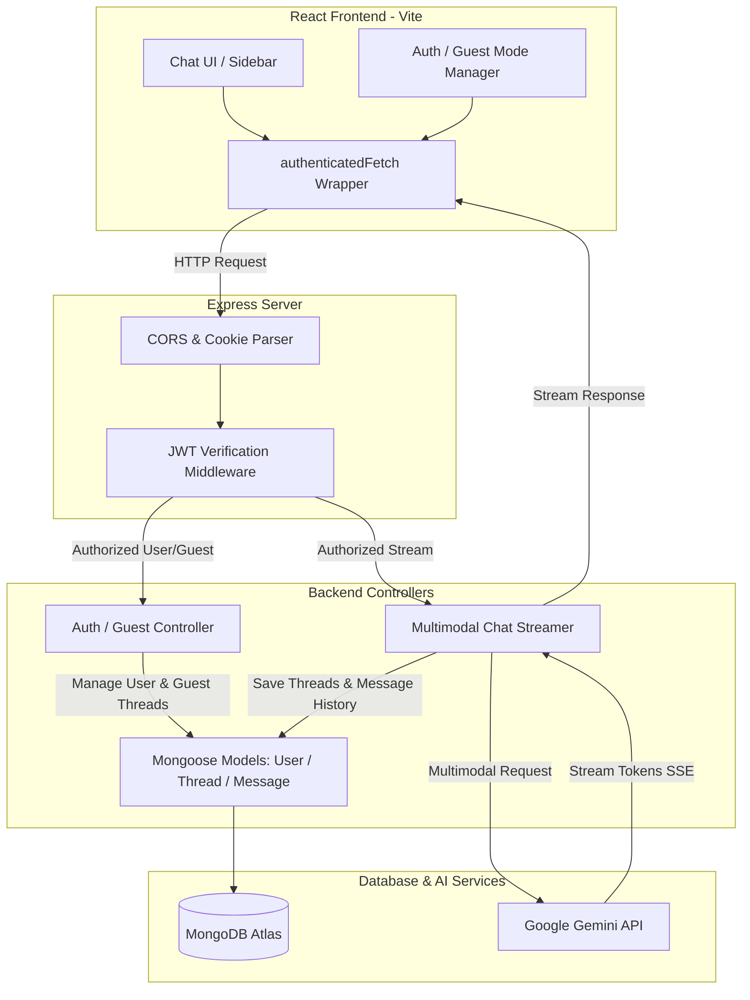

# JARVIS — Advanced Multimodal AI Chat Platform

JARVIS is a full-stack, production-ready AI chat platform built with Node.js, Express, React (Vite), and MongoDB. It integrates the Google Gemini API to deliver real-time, token-streamed responses (Server-Sent Events) and supports multimodal inputs including text, images, audio, and video. 

The system features robust security, a seamless **Guest Mode** with automatic history migration, and automated JWT token rotation.

---

## 🌟 Key Features

*   **Multimodal AI Streaming**: Interactive chat experience with real-time SSE token-by-token streaming from Gemini 2.0. Supports text prompts along with images, audio, and video attachments.
*   **Dual-Session Architecture (Guest Mode & Member Mode)**:
    *   **Guest Mode**: Visitors can chat instantly without creating an account. Conversations are saved locally and securely mapped on the database using temporary guest sessions.
    *   **History Migration**: Upgrading from guest to member seamlessly transfers all active guest conversations to the new registered account.
*   **Secure Session & Token Management**:
    *   JWT Access Tokens (short-lived) paired with secure, `HttpOnly` Refresh Tokens (long-lived, 7 days) to prevent XSS/CSRF.
    *   Silent token refresh: Frontend interceptors automatically refresh expired tokens in the background without interrupting the user.
*   **Resilient Design & User Experience**:
    *   Sophisticated error parser translating API tracebacks (like Gemini 429 rate limits) into clear, friendly guidance.
    *   Modern glassmorphic dark mode dashboard with active thread state, text filters, and responsive design.

---

## 🏗️ Architecture & Data Flow



---

## 📂 Project Structure

```
JARVIS/
├── backend/
│   ├── config/          # Environment variables & constants configuration
│   ├── models/          # Mongoose database schemas (User, Thread, Message)
│   ├── routes/          # REST endpoints (auth, chat, threads)
│   ├── utils/           # Helper libraries (logger, token generator, response wrapper)
│   └── server.js        # Express initialization & server bindings
├── frontend/
│   ├── src/
│   │   ├── assets/      # Graphical logo and static files
│   │   ├── App.jsx      # React router, Context provider & Fetch interceptors
│   │   ├── Auth.jsx     # Login, Sign Up, and Guest login forms
│   │   ├── Sidebar.jsx  # Thread navigation, search, and history upgrade banner
│   │   ├── ChatWindow.jsx # Chat container, file selectors, and profile menu
│   │   └── Chat.jsx     # Chat bubbles, ReactMarkdown, and highlighter
│   ├── vite.config.js
│   └── index.html
└── README.md
```

---

## ⚙️ Configuration & Environment Variables

Create a `.env` file in the `backend` directory:

```env
PORT=8080
MONGODB_URI=your_mongodb_atlas_connection_string
JWT_SECRET=your_jwt_access_secret_key
JWT_REFRESH_SECRET=your_jwt_refresh_secret_key
GEMINI_API_KEY=your_google_gemini_api_key
```

Create a `.env` file in the `frontend` directory:

```env
VITE_API_URL=http://localhost:8080/api/v1
```

---

## 🚀 Getting Started

### 1. Prerequisites
*   Node.js (v18+)
*   MongoDB Instance (Local or Atlas)
*   Google Gemini Developer API Key

### 2. Backend Setup
1.  Navigate to the backend directory:
    ```bash
    cd backend
    ```
2.  Install dependencies:
    ```bash
    npm install
    ```
3.  Start the development server:
    ```bash
    npm run dev
    ```

### 3. Frontend Setup
1.  Navigate to the frontend directory:
    ```bash
    cd ../frontend
    ```
2.  Install dependencies:
    ```bash
    npm install
    ```
3.  Start the development server:
    ```bash
    npm run dev
    ```
4.  Open [http://localhost:5173](http://localhost:5173) in your browser.

---

## 🔒 Security Practices

1.  **Strict HTTP-Only Cookies**: Refresh tokens are stored exclusively inside `HttpOnly`, `Secure` (in production), and `SameSite=Strict` cookies to block XSS and cookie-hijacking.
2.  **Stateless Access Tokens**: Short-lived Access JWTs are signed with a 15-minute expiration window to reduce token exposure.
3.  **Encrypted Credentials**: Passwords are secure-hashed using `bcrypt` with 10 salt rounds before database storage.
